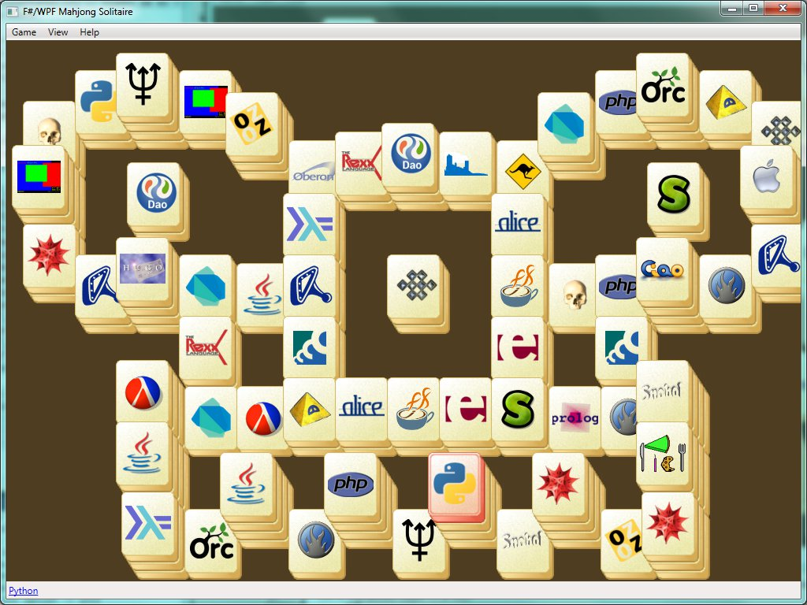

A sample F#/WPF script implementing Mahjong Solitaire game, that uses different programming languages as glyphs on the stones.

As a bonus, one can open a web-page with information about the selected stone's programming langugage.

A bit more detailed description is in the [corresponding blog post](gdreflections.com/2012/11/mahjong-solitaire-puzzle-game-in-fwpf.html).

